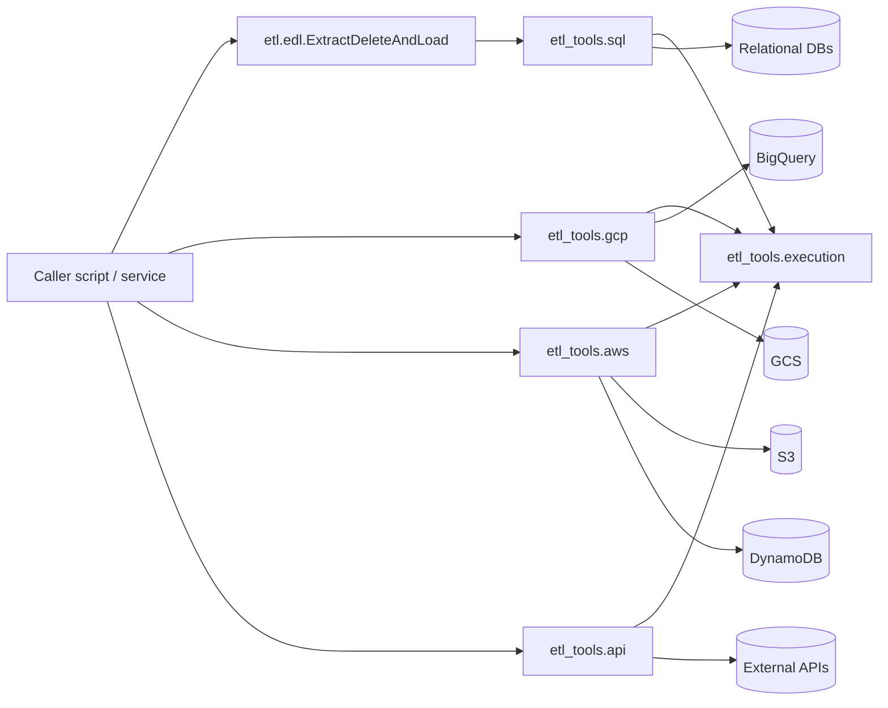
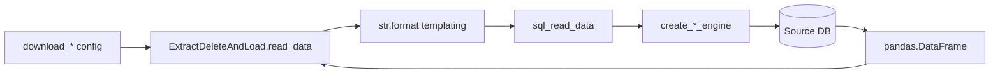
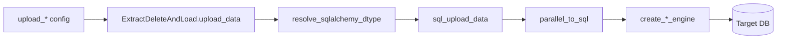

# Architecture

[← Back to documentation index](README.md)

## System overview

GenETL is a **library** (not a service). It is consumed by other Python
applications or scripts that need to move data between heterogeneous
backends. There is no long-running process: callers instantiate
`ExtractDeleteAndLoad` (or call the lower-level helpers directly) and
drive the ETL process from their own runtime.

## Core components

### `etl.edl.ExtractDeleteAndLoad`

Source: [src/etl/edl.py](../src/etl/edl.py)

Stateful orchestrator. The constructor takes three dictionaries:

- `config_dict` — per-process configuration (statements, schemas, tables,
  dtype specs, etc.)
- `conn_dict`   — connection definitions keyed by
  `<conn_type>_<conn_name>` (e.g. `sqlalchemy_oltp`, `bigquery_analytics`)
- `sqlalchemy_dict` — optional override mapping from alias names to
  SQLAlchemy types. Values may be type classes/callables or dotted-path
  strings rooted at `sqlalchemy` (e.g. `"sqlalchemy.types.String"`),
  resolved safely by
  [`resolve_sqlalchemy_path`](../src/etl_tools/sql.py). Merged on top of
  [`SQLALCHEMY_DTYPES`](../src/etl_tools/sql.py).

It exposes four methods that operate over the corresponding
`<process>_*` sub-dictionaries: `read_data()`, `delete_data()`,
`truncate_data()`, `upload_data(data_to_upload)`.

### `etl_tools.sql`

Source: [src/etl_tools/sql.py](../src/etl_tools/sql.py)

- **Engine factories**: `create_sqlalchemy_engine`,
  `create_bigquery_engine`, `create_redshift_engine`,
  `create_oracle_engine`, `create_mysql_engine`,
  `create_cloudsql_engine`
- **Connection factories**: `create_*_conn` counterparts plus
  `create_pyodbc_conn`
- **High-level helpers**: `sql_read_data`, `sql_upload_data`,
  `sql_copy_data`, `sql_exec_stmt`, `parallel_to_sql`,
  `to_sql_executemany`, `to_sql_redshift_spark`
- **Dtype mapping**: `SQLALCHEMY_DTYPES`, `resolve_sqlalchemy_dtype`,
  `resolve_sqlalchemy_path`
  (safe replacement for the old `eval`-based mechanism)

Internal dispatch tables `_CONN_FACTORIES` and `_ENGINE_FACTORIES` make
the `mode` parameter explicit, validated and easy to extend.

### `etl_tools.gcp`

Source: [src/etl_tools/gcp.py](../src/etl_tools/gcp.py)

GCS upload/download/delete helpers, BigQuery ↔ GCS transfers and Cloud
SQL ↔ GCS imports/exports through the Cloud SQL Admin API. All BigQuery
and Cloud SQL operations now log and re-raise `google.api_core`/
`googleapiclient` errors so missing tables/schemas surface to the caller.

### `etl_tools.aws`

Source: [src/etl_tools/aws.py](../src/etl_tools/aws.py)

S3 read/write helpers (CSV, JSON, parquet, pickle) and DynamoDB
read/upload helpers. DynamoDB kwargs are no longer evaluated with
`eval()`; callers must construct any boto3 `Key`/`Attr` objects before
passing them in. Errors are caught at the boto3 boundary and re-raised.

### `etl_tools.api`

Source: [src/etl_tools/api.py](../src/etl_tools/api.py)

Wrapper around `requests` that dispatches verbs through a small
registry, calls `raise_for_status()`, and returns JSON when possible
(falling back to text with a logged warning).

### `etl_tools.execution`

Source: [src/etl_tools/execution.py](../src/etl_tools/execution.py)

- `setup_logger` — thread-safe queue-based logger configuration
- `mk_exec_logs`, `mk_texec_logs`, `mk_err_logs` — append-only on-disk
  log writers reused by `sql.py`
- `parallel_execute` — `ProcessPoolExecutor` wrapper with
  `functools.partial` keyword-argument binding
- `execute_script` — subprocess wrapper with `shell=False` and full
  output capture

## Data flow

### Download path

### Upload path

## Integration points

| Backend       | Reached via                          | Auth/config keys                                                        |
| ------------- | ------------------------------------ | ----------------------------------------------------------------------- |
| SQL Server    | `pyodbc` / `sqlalchemy`              | `server`, `database`, `username`, `password`, `driver`, `port`          |
| Oracle        | `oracledb` / SQLAlchemy `oracle+cx_oracle` | `oracle_client_dir`, `server`, `database`, `username`, `password` |
| MySQL         | `pyodbc` / SQLAlchemy `mysql+pymysql` | `server`, `database`, `username`, `password`, `port`, `charset`        |
| Redshift      | `redshift_connector` / SQLAlchemy    | `server`, `database`, `username`, `password`, `port`, `sslmode`         |
| BigQuery      | `sqlalchemy-bigquery` / `google-cloud-bigquery` | `database` (project.dataset), `location`                    |
| Cloud SQL     | `cloud-sql-python-connector` / SQLAlchemy | `instance_connection_name`, `database_type`, `database`, `username`, `password` |
| GCS           | `google-cloud-storage`               | Application Default Credentials or supplied `client`                    |
| S3            | `boto3` / `awswrangler`              | `aws_access_key`, `aws_secret_access_key`, `region_name`                |
| DynamoDB      | `boto3`                              | `aws_access_key_id`, `aws_secret_access_key`, `region_name`             |
| HTTP APIs     | `requests`                           | Caller-supplied `headers` / `params` / `json`                           |

## Design patterns

- **Strategy via dispatch tables** — `_CONN_FACTORIES` and
  `_ENGINE_FACTORIES` in `sql.py` decouple `mode` strings from concrete
  factory functions.
- **Safe templating** — `str.format` with a strict mapping replaces
  the old `eval(stmt)` SQL templating.
- **Safe dtype resolution** — `resolve_sqlalchemy_dtype` uses
  `ast.literal_eval` to parse only literal arguments, never code.
- **Safe dotted-path resolution** — `resolve_sqlalchemy_path` walks
  attributes from an allow-listed root (`sqlalchemy`) via `getattr`,
  refusing private attributes and unknown roots; this lets callers send
  dtype values as strings (e.g. `"sqlalchemy.types.String"`) without
  `eval`/`exec`.
- **Retries with logging** — `sql_read_data`, `sql_upload_data`,
  `sql_copy_data` retry up to `max_n_try` times and persist both
  summary and detailed error logs.

## Configuration

Configuration is entirely in-memory (Python dictionaries). There are no
environment variables or YAML files read by the library itself. See
[data-models.md](data-models.md) for the full schema.
